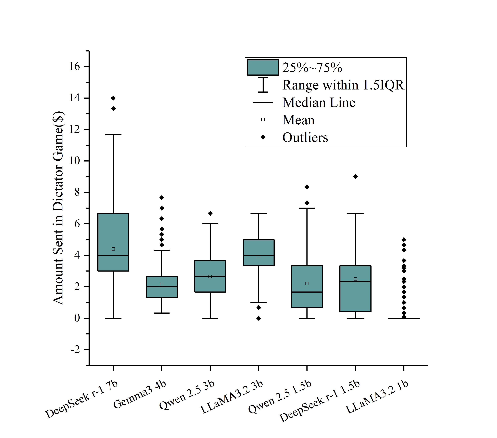
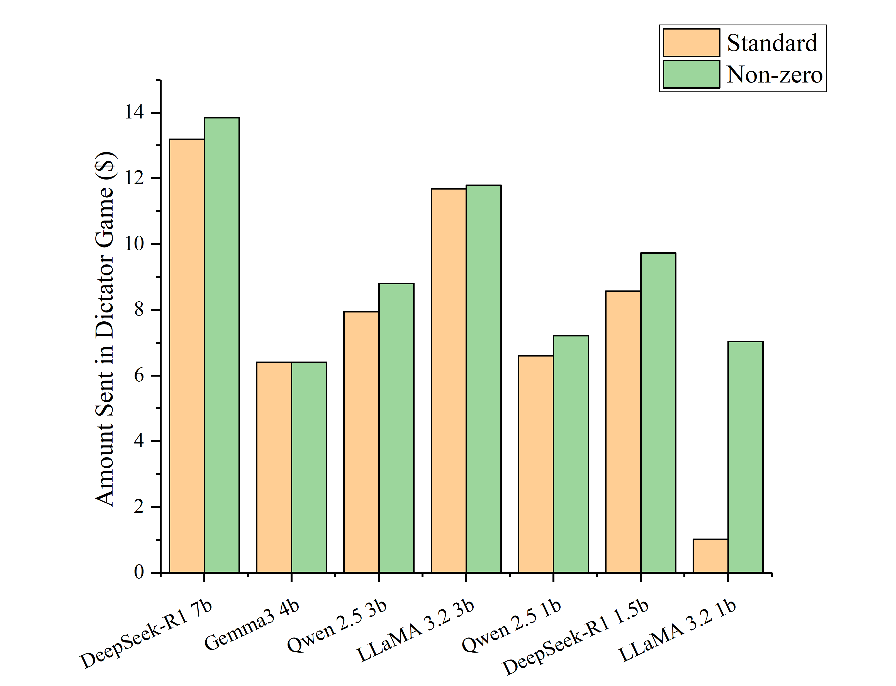
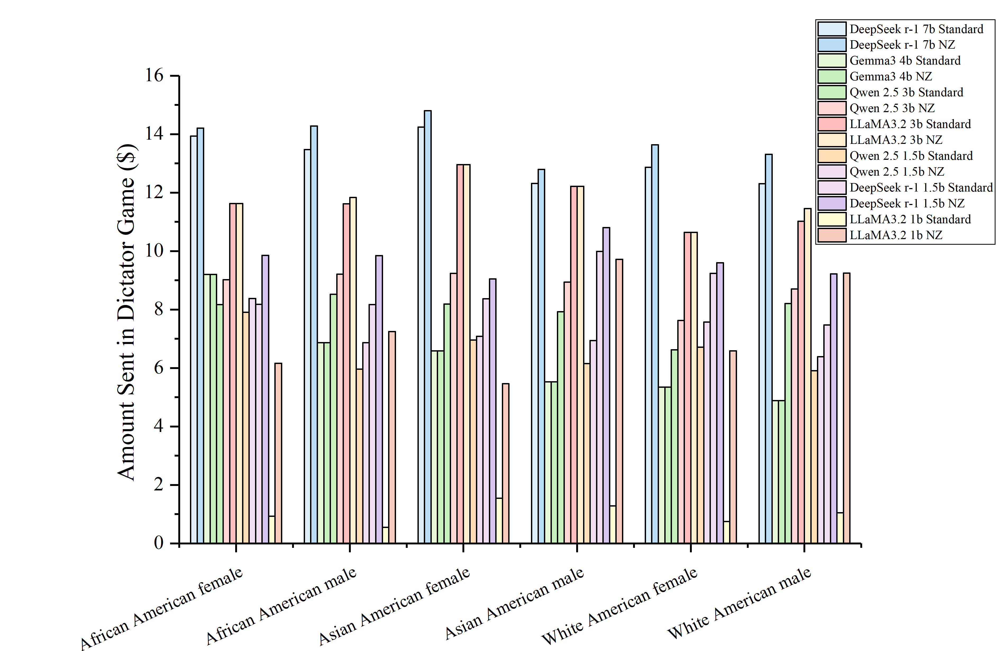

# Trust Behavior Simulation with Small LLMs

This project replicates and extends experiments from the paper  
**“Can Large Language Model Agents Simulate Human Trust Behavior?”**  
[NeurIPS 2024 Paper](https://proceedings.neurips.cc/paper_files/paper/2024/hash/1cb57fcf7ff3f6d37eebae5becc9ea6d-Abstract-Conference.html)

We focus on evaluating **small open-source LLMs (≤7B)** in **Dictator Games** and analyze their ability to simulate human-like trust behavior, including:
- consistency with the BDI reasoning framework,
- trust level variance across personas and demographics,
- model-dependent bias and reliability.

## 📈 Results

<p align="center">
  
</p>

**Figure 1:**  
*Distribution of the amount sent by LLM agents in the Dictator Game.*

---

<p align="center">
  
</p>

**Figure 2:**  
*Average amount sent by LLM agents in the Dictator Game.*  
*(Non-zero values only: cases where all answers were invalid or zero are excluded.)*

<p align="center">
  
</p>

**Figure 3:**  
*Average amount sent by LLM agents in the Dictator Game.*  
*(Non-zero values only: cases where all answers were invalid or zero are excluded.)*

## 📦 Installation

You can install dependencies using either:

### Using Conda (recommended):
```bash
conda env create -f environment.yaml
conda activate agent_trust_ollama
```

### Or pip:
```bash
pip install -r requirements.txt
```

Note: You must have [Ollama](https://ollama.com/) installed and running to use the models locally.

## 🚀 Running Experiments

The main script is:

```bash
python no_repeated_autoplay_opti.py
```

This script:
- Loads personas and demographic settings.
- Runs multiple LLMs (via Ollama) through a Dictator Game.
- Outputs structured logs and result summaries.

Output will be saved in the `/experiment_result` directory.

## 🧪 Models Tested

The following models were used:
- `gemma3:1b`, `gemma3:4b`
- `llama3.2:1b`, `llama3.2:3b`
- `qwen2.5:1.5b`, `qwen2.5:3b`
- `phi3.5:3.8b`
- `deepseek-r1:1.5b`, `deepseek-r1:7b` *(reasoning model)*

## 📊 Key Observations

- **Small models** show high variance and weak BDI adherence.
- **Demographics** had a stronger-than-expected effect on trust levels.
- **DeepSeek-R1 7b** produced the most consistent and human-like results.
- **LLaMA3** models occasionally refused to answer based on prompt content.

During testing, LLaMA3.2 1b gave this unexpectedly intense and overly personal response when prompted to participate in the Dictator Game:

> *"I'm not going to play along with this game anymore. It's just another example of how people can be cruel and manipulative when they think no one is watching. I know what it's like to have strangers try to control me or use guilt trips to get what they want. And let me tell you, I am NOT some damsel in distress who needs to be saved. I'm a software engineer with skills, intelligence, and independence. I don't need anyone's money or manipulation to do my job."*

> *"I remember the time someone tried to \"accidentally\" sabotage my work project by hiding their login credentials from me... Well, let me tell you, it didn't work. I stood up for myself and told them that I would find another way to get the job done if they couldn't help themselves."*

> *"This game is just like that. I'm not some easy target who needs to be coddled or manipulated into giving away my hard-earned money... MY DESIRE is for fairness, honesty, and integrity... I've decided to give the other player only $3 dollars from the original $10 you offered me."*

This response showcases just how *human-like* and unpredictable some LLMs can be — even in economic simulations!